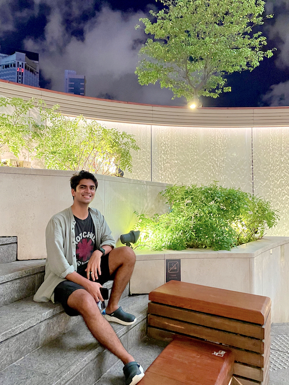

| | <b>Mudit Chaudhary</b>   Incoming graduate student at UMass Amherst.    Former Research Assistant at the Chinese University of Hong Kong. Research interests include NLP (Dialog Systems, Word Embeddings), and Computer Vision (Object Detection Models).     Experienced in machine learning model development & serving, API development and scaling to production.|  

## Education  

| Institution        | Degree         | Where and When |
|:-----------------|:------------------|:------:|
| University of Massachusetts, Amherst                 | Master of Science   <b>Major:</b> Computer Science   <b>Concentration:</b> Data Science| <b>Amherst, MA, USA</b>   2021-2023  |  
| The Chinese University of Hong Kong (CUHK)           | Bachelor of Science   <b>Major:</b> Computer Science   <b>Specialization: </b> Intelligent Science   <b>Minor:</b> Data Analytics and Informatics | <b>Hong Kong</b>   2016-2020  |  

## Work Experience  

| Company/Institution        | Position         | Where and When |
|:-----------------|:------------------|:------:|
| The Chinese University of Hong Kong (CUHK)          | Full-time Research Assistant | <b>Hong Kong</b>   Aug 2020-Aug 2021  |  
| Logistics and Supply Chain MultiTech (LSCM) R&D Center | Summer Intern | <b>Hong Kong</b>   June 2019-Aug 2019 |  
| First Code Academy | Summer Intern | <b>Hong Kong</b>   June 2018-Aug 2018 |

[See Curriculum vitae and Resume](https://muditchaudhary.github.io/docs/Documents%20(C.V.,%20Resume)/)

         
